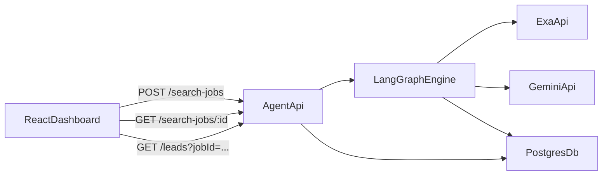

# Plan Maestro: Medicatel Lead Engine (MLE)

## 1. Definición del Producto
**Medicatel Lead Engine** es un sistema de agentes autónomos diseñado para la prospección inteligente de leads en el sector salud (inicialmente médicos en Honduras) y escalable a otros sectores B2B (aseguradoras, proveedores). 

El sistema no solo busca nombres; utiliza **búsqueda semántica neuronal** y **razonamiento de IA** para extraer datos de contacto verificados (WhatsApp, Email, LinkedIn) y calificar la relevancia de cada prospecto antes de guardarlo en una base de datos centralizada.

---

## 2. Estado de Infraestructura (`.env`)
Ya contamos con las siguientes integraciones configuradas:
- **LLM:** Google Gemini (vía `GOOGLE_API_KEY`).
- **Search Engine:** Exa.ai (vía `EXA_API_KEY`) usando tecnología de **Websets**.
- **Observabilidad:** LangSmith (Tracing activo para depuración de agentes).
- **Persistencia:** PostgreSQL (vía `DATABASE_URL`).

---

## 3. Hoja de Ruta de Desarrollo (Fases)

### Fase 1: Estructura de Datos (Data Contract)
- Definir esquemas de **Pydantic** para los Leads.
- Configurar el ORM (**SQLModel** recomendado por ser la unión de SQLAlchemy y Pydantic) para la base de datos.

### Fase 2: Implementación de Nodos (Agentes)
- **Planner Node:** Transforma un input simple en una configuración técnica de Exa Webset.
- **Exa Webset Node:** Lanza la búsqueda asíncrona, gestiona el tiempo de espera (polling) y descarga resultados enriquecidos.
- **Scoring & Cleaning Node:** Gemini procesa los resultados de Exa para limpiar alucinaciones y calificar al lead del 1 al 10.

### Fase 3: Orquestación (LangGraph)
- Construir el grafo de estados.
- Implementar la persistencia del hilo (Checkpointers) para que las búsquedas largas no se pierdan.

### Fase 4: Exportación y Almacenamiento
- Nodo final para insertar leads calificados en PostgreSQL.
- Generación de logs de éxito/error visibles en LangSmith.

### Fase 5: Frontend & UX (React + Vite)
- Crear una SPA en **React + TypeScript + Vite** para operar el motor de leads.
- Implementar cuatro vistas principales:
  - **Búsqueda:** crear job de prospección.
  - **Ejecución:** monitorear estado y progreso del job.
  - **Resultados:** listar, filtrar y ordenar leads.
  - **Detalle de lead:** ver contactos, score, justificación y fuentes.
- Implementar manejo de estados asíncronos de UI: `idle`, `loading`, `success`, `error`.
- Integrar el diseño visual inspirado en Coinbase con tokens reutilizables (color, tipografía, spacing, radios).

### Fase 6: Contrato API Frontend-Backend
- Definir endpoints REST para jobs y leads.
- Estandarizar payloads (`request`/`response`) con tipos explícitos y versionado de contrato.
- Definir política de errores consistente (`code`, `message`, `details`) para facilitar UX y debugging.
- Publicar contrato en un documento único para backend y frontend.

### Fase 7: Calidad de Producto (UI + API)
- Definir criterios de aceptación de UX:
  - Feedback visual claro durante cargas largas.
  - Mensajes de error accionables.
  - Tiempos de respuesta percibidos aceptables (skeletons, estados parciales).
- Definir pruebas mínimas:
  - Frontend: render, flujo de creación de job, estados de error y vacío.
  - Backend API: validación de payloads y códigos de estado.
- Revisar accesibilidad base (contraste, foco visible en botones, navegación teclado).

---

## 4. Reglas de Desarrollo (Python & Agents)

Como no vienes del mundo Python, estas reglas son críticas para que **Cursor** genere código de alta calidad y fácil de mantener:

### A. Type Hinting Obligatorio (PEP 484)
En Python moderno, los tipos no son obligatorios pero **son esenciales para Cursor**.
- **Regla:** Todas las funciones deben tener tipos de entrada y salida definidos.
- *Ejemplo:* `def process_lead(data: dict) -> LeadSchema:`

### B. Uso de Pydantic para Validar Datos
No uses diccionarios (`dict`) simples para mover datos críticos.
- **Regla:** Usa modelos de Pydantic para asegurar que si Exa cambia un formato, el código falle inmediatamente con un error claro en lugar de propagar basura.

### C. Programación Asíncrona (`asyncio`)
Las llamadas a APIs (Gemini, Exa) y Base de Datos son "I/O Bound" (espera de red).
- **Regla:** Usa `async/await`. Esto permitirá que tu motor procese múltiples médicos en paralelo sin bloquearse.

### D. Patrón "Node-Function" de LangGraph
- **Regla:** Cada agente debe ser una función pura que recibe un `State` y devuelve un `dict` con los cambios al estado. Nunca modifiques el estado global directamente.

### E. Manejo de Errores "Graceful"
Los agentes suelen fallar por timeouts de API o datos inesperados.
- **Regla:** Todo nodo debe estar envuelto en un `try-except`. Si un nodo falla, debe marcar el lead como "error" en el estado en lugar de romper todo el grafo.

### F. Logging sobre Printing
- **Regla:** No uses `print()`. Usa la librería `logging`. Esto permite que LangSmith capture mejor los eventos y que en el futuro puedas ver logs en un servidor.

### G. Principio de "Explicit over Implicit" (Zen de Python)
- **Regla:** Es mejor ser detallado en el código que intentar ser "mágico" o demasiado conciso. Cursor entiende mejor las instrucciones explícitas.

---

## 5. Arquitectura de Integración Web



- **Frontend:** React + Vite consume la API del motor.
- **Backend API:** capa HTTP que orquesta LangGraph y persistencia.
- **Motor de Agentes:** ejecuta Planner, Exa, Scoring y limpieza.
- **Persistencia:** PostgreSQL almacena jobs, leads y estados.

---

## 6. Contrato API Base (MVP)

### Endpoints
- `POST /search-jobs` crea un job de búsqueda.
- `GET /search-jobs/{job_id}` devuelve estado del job.
- `GET /leads?job_id={job_id}` lista leads del job.
- `GET /leads/{lead_id}` devuelve detalle del lead.
- `POST /leads/export` exporta leads filtrados.

### Modelo de respuesta de error
```json
{
  "error": {
    "code": "INVALID_REQUEST",
    "message": "Solicitud inválida",
    "details": {}
  }
}
```

---

## 7. Criterios de Aceptación de UI (MVP)

- El usuario puede crear un job y ver su estado sin recargar la página.
- Los resultados muestran score, datos de contacto y fuente principal.
- La UI muestra estados vacíos, carga y error en todas las vistas críticas.
- Los botones de acción primaria usan estilo pill (radio 56px) y foco visible.
- El dashboard es usable en desktop y tablet sin romper layout principal.

---

## 8. Instrucciones para Cursor (Prompt Inicial)

Cuando empieces a programar con Cursor, puedes darle este contexto:

> "Cursor, lee el archivo `DEVELOPMENT_PLAN.md`. Vamos a empezar con la **Fase 1**. Crea un modelo de datos usando SQLModel para los Leads de Médicos, asegurándote de incluir campos para la info de contacto de Exa y un campo de metadata para LangSmith. Aplica las reglas de Type Hinting y Async definidas en el plan."

---

### ¿Por qué estas reglas adicionales a SOLID?
1. **Type Hinting:** Ayuda a Cursor a darte mejores sugerencias de autocompletado y detectar errores antes de ejecutar.
2. **SQLModel/Pydantic:** Reduce el código repetitivo entre la base de datos y la IA.
3. **Async:** Es la diferencia entre que tu búsqueda tarde 5 minutos o 30 segundos.

